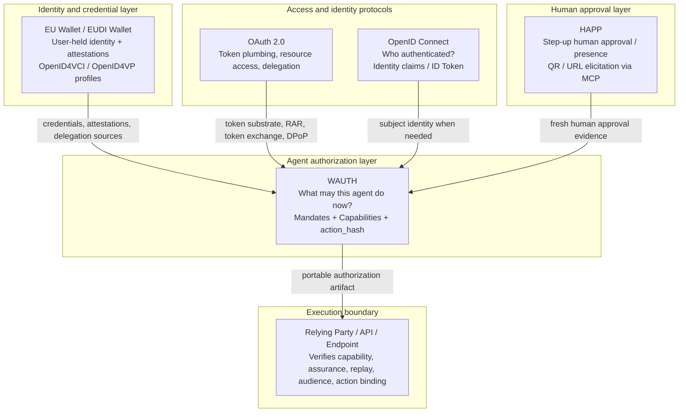

# AAIF Wallet Authorization Protocol (WAuth)

> **Community Draft** — intended to gather implementer feedback. Backwards-incompatible changes may occur until v1.0.

## Overview

WAuth is a protocol for issuing **portable, auditable authority** to agents without giving them a user’s root keys.

It standardizes two primitives:

- **Mandates** — reusable, envelope-bounded authority (“you may do *this class* of actions under these constraints”)
- **Capabilities** — per-action, short‑lived, action‑hash‑bound authorizations (“you may do *this exact instance* now”)

WAuth is designed to be delivered as an **MCP profile** (tool interface), and to compose with:

- **HAPP** for step‑up human approvals (EU Wallet / iProov / YubiKey are *profiles* behind HAPP)
- **OpenID4VCI / OpenID4VP** as optional interop bridges for credential issuance and presentation
- **OAuth RAR `authorization_details` (RFC 9396)** as the shared “requirements and grants” model

### Features

- Least privilege via **envelopes**
- Bounded autonomy via **Mandate → Capability**
- Replay resistance via **single-use capabilities** + short expiry
- Sender constraint via **PoP / DPoP-style binding**
- RP adoption wedge via **standard requirement signaling** (`wauth_required`) and metadata discovery (RFC 9728)
- Agent identity + workload attestation profile for strong agent authentication
- Lifecycle + SCIM profile for provisioning, rotation, suspension, and revocation
- Provenance + risk profiles for transparency, non-repudiation, and prompt-safety containment
- Vendor- and storage-neutral via **role-based architecture**


---


## Positioning: OAuth 2.0, OIDC, EU Wallet

WAuth is easiest to understand as the missing **agent-authorization layer** that sits between identity/wallet systems and the relying party execution boundary.

- **OAuth 2.0** provides the access-token and protected-resource framework.
- **OIDC** provides user authentication and identity claims.
- **EU Wallet / EUDI Wallet** provides user-held, regulated credentials and attestations.
- **HAPP** provides fresh human approval / presence when step-up is required.
- **WAuth** turns those inputs into **Mandates** and **Capabilities** that a relying party can verify for one exact action.

### Positioning diagram



### The boundary in one line

- **OAuth 2.0:** how access tokens are obtained and used
- **OIDC:** who authenticated
- **EU Wallet:** where the human's trusted credentials live
- **WAuth:** what the agent is allowed to do at the endpoint


## Status

**Draft v0.5.0**

- This document defines protocol roles, artifacts, verification semantics, and RP adoption profiles.
- It does **not** require any specific wallet product, cloud vault, or storage implementation.

---

## Abstract

The AAIF Wallet Authorization Protocol (WAuth) defines a framework for delegating constrained authority to software agents using verifiable, replay-resistant authorization artifacts. WAuth introduces a deterministic **Action Instance** model and two core authorization artifacts: a reusable **Mandate** bounded by an **Envelope** of constraints, and a per-action **Capability** bound to an **action_hash**. WAuth is designed to integrate with MCP as a tool-facing boundary and to compose with HAPP for step-up human approvals and OpenID4VCI/OpenID4VP for credential ecosystem interoperability.

---

## Motivation

Agents increasingly execute high-consequence actions (purchases, account changes, submissions). Existing auth patterns often prove only that a caller is authenticated, not that:

- the caller is acting under **least privilege**
- the authority is **auditable** and **bounded**
- the authorization is **replay-resistant** and tied to **the exact action instance**
- step-up approvals happen **when the RP requires them**, not when the agent “chooses to”

WAuth standardizes the missing layer: portable authorization semantics suitable for agent runtimes **and** a practical way for endpoints (“locks”) to demand stronger auth.

---

## Scope & Non-Goals

### In scope

- A role-based model for authorization at a wallet boundary
- Mandate/Capability artifacts and verification semantics
- Deterministic canonicalization and hashing of action instances
- Monotonic subdelegation rules for envelopes
- MCP profile (`aaif.wauth.*`) with legacy alias compatibility (`aaif.pwma.*`)
- Discovery (`/.well-known/aaif-wauth-configuration`) and JWKS publishing
- **RP adoption profiles**:
  - WAUTH-RP-REQSIG (runtime requirement signaling)
  - WAUTH-RP-PRM (Protected Resource Metadata advertisement)

### Out of scope

- Standardizing biometric methods, liveness algorithms, or UX (handled via HAPP profiles)
- Standardizing payment rails or merchant checkout APIs
- Forcing a specific credential format (VC-DM, SD‑JWT, mdoc, JWT) beyond verification requirements
- Mandating one policy DSL (CEL/OPA/Cedar are supported via a common policy interface)

---

## Design Principles

1) **Key separation** — agents do not receive user root keys.
2) **Bounded autonomy** — reusable authority is always constrained by an envelope.
3) **Action binding** — execution authority is tied to an `action_hash`.
4) **Replay resistance** — capabilities are short-lived and typically single-use.
5) **Monotonic subdelegation** — derived authority can only become narrower.
6) **Deployment neutrality** — roles can be co-located or separated.
7) **Locks + keys** — endpoints must be able to demand stronger auth (standard requirement signaling).

---

## Model Overview

### Roles

- **Agent Host (AH):** LLM runtime + MCP client
- **Wallet Authorization Service (WAS):** policy, mandate/capability issuance
- **Credential Store (CS):** stores credentials, mandates, receipts (local/cloud/enterprise)
- **Key Custody Service (KCS):** holds agent PoP keys (SE/HSM/TEE/threshold)
- **Presence Provider (PP):** step-up approvals via HAPP
- **Relying Party (RP):** executes the action and enforces requirements

### Architecture (Mermaid)

```mermaid
flowchart LR
  AH[Agent Host\n(LLM runtime + MCP client)] -->|aaif.wauth.request| WAS[WAS\nPolicy + Mandates + Caps]
  WAS --> CS[Credential Store\n(local / cloud / enterprise)]
  WAS --> KCS[Key Custody Service\n(SE / HSM / TEE / threshold)]
  WAS -->|Step-up via HAPP when policy requires| PP[Presence Provider\n(EU Wallet / iProov / YubiKey)]
  WAS -->|Optional| OID[OpenID bridges\n(OID4VCI / OID4VP)]
  AH -->|Calls APIs| RP[Relying Party\n(enforces requirements)]
  RP -->|Discovery + JWKS| WAS
```

### RP requirement signaling (Mermaid)

```mermaid
sequenceDiagram
  participant A as Agent Host
  participant R as Relying Party (RP)
  participant W as WAS (aaif.wauth.*)
  participant P as Presence Provider (HAPP)

  A->>R: Execute action (no/weak auth)
  R-->>A: 401/403 + wauth_required (authorization_details + binding)
  A->>W: aaif.wauth.request(wauthRequired + actionInstance)
  alt Step-up required by policy
    W-->>A: elicitation (QR/URL)
    A->>P: User completes step-up
    P-->>W: HAPP Consent Credential (HAPP-CC)
  end
  W-->>A: WAUTH-CAP (jwt) bound to action_hash
  A->>R: Retry action + WAUTH-CAP (+ DPoP)
  R-->>A: 200 OK (cap consumed; action executed)
```

---

## Terminology

- **Envelope:** a set of constraints (amount, audience, merchant, categories, expiry, max uses, etc.)
- **Mandate:** reusable authority bounded by an envelope and bound to an agent identity / PoP key
- **Capability:** per-action authority bound to `action_hash`, audience, expiry, and PoP
- **Action Instance:** canonical JSON describing *this exact action* (cart, totals, destination, etc.)
- **action_hash:** hash of the canonicalized action instance (RFC 8785 JCS)
- **Step-up:** a policy-triggered user interaction yielding verifiable approval evidence (HAPP)

---

## Core Components

### Artifacts

- **WAUTH-INTENT:** agent request to create/refresh mandates or mint a capability
- **WAUTH-MANDATE:** reusable, envelope-bounded authority
- **WAUTH-CAP:** per-action authorization (short-lived, action-bound)
- **WAUTH-REC:** receipt/audit event
- **WAUTH-CONFIG:** discovery metadata including `jwks_uri`

### RP Adoption profiles

- **WAUTH-RP-REQSIG:** RPs return `wauth_required` using **RFC 9396 `authorization_details`** so “requirements” and “grants” share one structure.
- **WAUTH-RP-PRM:** RPs publish supported WAUTH features via **RFC 9728 Protected Resource Metadata** (preflight discovery).

### Policy management (proposal)

WAuth standardizes policy *outputs* as:

- `permit`, `deny`, or `wauth_required + authorization_details`

This enables reuse of existing policy engines (CEL / OPA / Cedar) while keeping integrations consistent.

---

## MCP Interoperability

WAuth defines a minimal MCP tool interface so agent runtimes invoke wallet authorization consistently.

- **Canonical namespace:** `aaif.wauth.*`
- **Legacy alias:** `aaif.pwma.*` (identical semantics)

Example call (informative):

```json
{
  "name": "aaif.wauth.request",
  "arguments": {
    "requestId": "req_...",
    "walletIntent": {
      "version": "0.2",
      "profile": "aaif.wauth.capability.generic/v0.2",
      "intentId": "550e8400-e29b-41d4-a716-446655440000",
      "issuedAt": "2026-02-27T12:00:00Z",
      "audience": { "id": "https://was.example" },
      "agent": { "id": "did:web:agent.example" },
      "operation": {
        "type": "capability.mint",
        "parameters": { "action_profile": "aaif.wauth.action.commerce.checkout_complete/v0.1" }
      },
      "constraints": {
        "expiresAt": "2026-02-27T12:10:00Z"
      }
    }
  }
}
```

---

## Quickstart

1) Define an envelope (e.g., shopping ≤ $1000, 30 days).
2) Acquire step-up approval via HAPP (when policy requires).
3) Issue a Mandate bound to the agent PoP key.
4) For each action instance, mint a Capability bound to `action_hash`.
5) RP verifies and atomically consumes capability `jti`.

---

## Conformance

Conformant implementations MUST:

- implement canonicalization and hashing for action instances
- enforce envelope monotonicity on subdelegation
- publish `WAUTH-CONFIG` and JWKS
- implement the MCP tool profile with required errors/elicitations

RPs MAY additionally claim:

- **RP-REQSIG** and/or **RP-PRM** to improve integrator experience.

---

## Security

WAuth mitigates:

- overbroad delegation (envelopes)
- silent escalation (monotonic subdelegation)
- replay (short expiry + single-use `jti`)
- token theft (PoP binding profiles)

WAuth does **not** by itself solve:

- endpoint compromise of the agent host
- coercion of a user during step-up

---

## Privacy

- Prefer selective disclosure and minimal presentation sets.
- Avoid putting full PII into envelopes; use hashes or references where practical.

---

## Registries

Proposed registries include:

- action profiles (`aaif.wauth.action.*`)
- intent profiles (`aaif.wauth.*.bridge`, `aaif.wauth.mandate.*`)
- RP requirement types (`authorization_details.type` URIs)

---

## Roadmap

- Additional action profiles (commerce, enterprise admin, filings)
- Formal policy interface standardization for gateways
- Interop events and test suites

---

## Working Group

Draft working group process: open GitHub issues + periodic implementer calls.

---

## FAQ

**Do I need a PWMA?**  
No. PWMA is a deployment profile. WAUTH standardizes roles and artifacts so you can deploy the “wallet governor” as a service, in a mobile wallet, in an enterprise boundary, or in a gateway.

**Is wwWallet required?**  
No. wwWallet is one possible storage/key-custody design. WAUTH is implementation-neutral.

---

## References

- RFC 9396 — OAuth 2.0 Rich Authorization Requests (authorization_details)
- RFC 9728 — OAuth 2.0 Protected Resource Metadata
- RFC 8785 — JSON Canonicalization Scheme (JCS)

## What v0.5.0 adds

### Workload identity and strong agent authentication

WAUTH now defines a portable **WAUTH-AGENT** metadata object and **WAUTH-ATTEST** evidence object so an RP can require more than “some key showed up.” Stable agent identity, ephemeral instance identity, organizational boundary, software identity, and attested PoP key binding can all be expressed and verified.

### Lifecycle and revocation propagation

WAUTH now defines **WAUTH-LIFECYCLE-EVT** and a SCIM mapping profile so enterprises can provision, rotate, suspend, revoke, and delete agent identities in a way that automatically affects capability minting and RP policy.

### Provenance, transparency, and non-repudiation

WAUTH now defines **WAUTH-EVT** for tamper-evident event chains that connect the agent, the authorization artifact, the human approval (if any), the input sources, and the final execution outcome.

### Prompt-safety containment and risk signals

WAUTH still does not claim to solve prompt injection by itself. Instead, it now standardizes **WAUTH-RISK** so prompt origin, source trust, suspicious instructions, and aggregate sensitivity can feed policy decisions that lead to `permit`, `deny`, or `wauth_required`.
