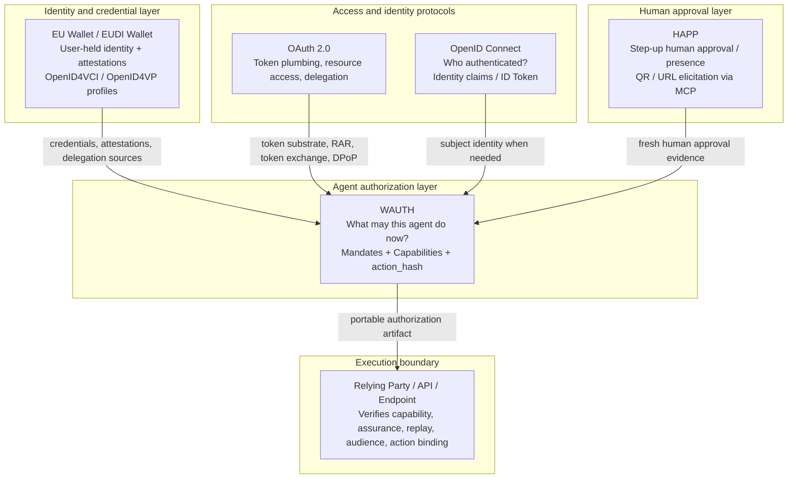

# WAuth positioning: OAuth 2.0, OIDC, EU Wallet

> A concise positioning note for reviewers, relying parties, and implementers.

## The simple view

- **OAuth 2.0** is the token and delegated-access framework.
- **OIDC** is the user-authentication and identity layer on top of OAuth.
- **EU Wallet / EUDI Wallet** is the regulated, user-held credential wallet ecosystem.
- **WAuth** is the agent-authorization layer that lets a relying party accept autonomous agent actions safely.

## Where WAuth sits

## Relationship by layer

### 1. OAuth 2.0

OAuth 2.0 gives WAuth the familiar token and protected-resource model. WAuth reuses OAuth-style patterns for issuance and consumption of short-lived capabilities, especially:
- structured fine-grained authorization via `authorization_details`
- sender constraint / proof-of-possession patterns
- audience and resource scoping
- token exchange / gateway-friendly deployment models

**OAuth answers:** "How does a client get and use access?"  
**WAuth adds:** "What exact action is this agent allowed to perform, at this endpoint, right now?"

### 2. OIDC

OIDC tells a relying party who authenticated and which claims are available about that user or organization. That matters when a WAuth decision needs an identity anchor, but OIDC alone does not express per-action delegated authority for autonomous agents.

**OIDC answers:** "Who authenticated?"  
**WAuth adds:** "What may the agent do on that subject's behalf?"

### 3. EU Wallet

The EU Wallet ecosystem gives the user a strong, regulated home for credentials, attestations, and delegations. In a WAuth deployment it can play several roles:
- source of credentials or delegation evidence
- source of subject/issuer trust anchors
- HAPP presence-provider profile for step-up approvals
- interoperability bridge via OpenID4VCI and OpenID4VP

**EU Wallet answers:** "How does the user hold and present trusted identity material?"  
**WAuth adds:** "How is that human authority turned into bounded, agent-usable authorization?"

## One-sentence positioning

**OAuth is the access framework, OIDC is the identity layer, the EU Wallet is the user-controlled credential ecosystem, and WAuth is the agent-safe authorization layer at the execution boundary.**
